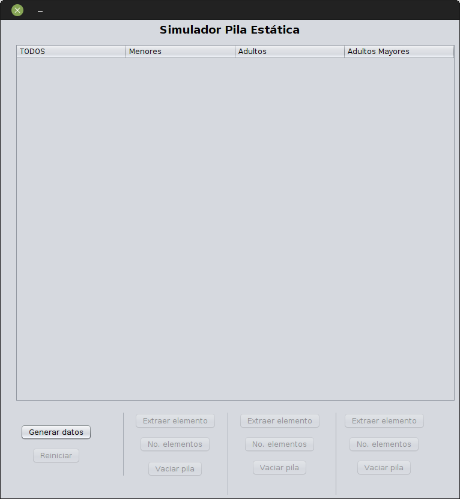
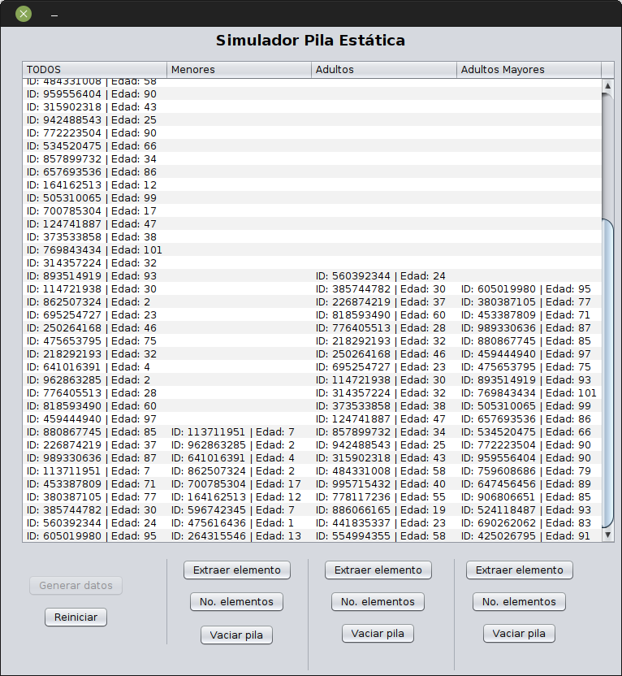
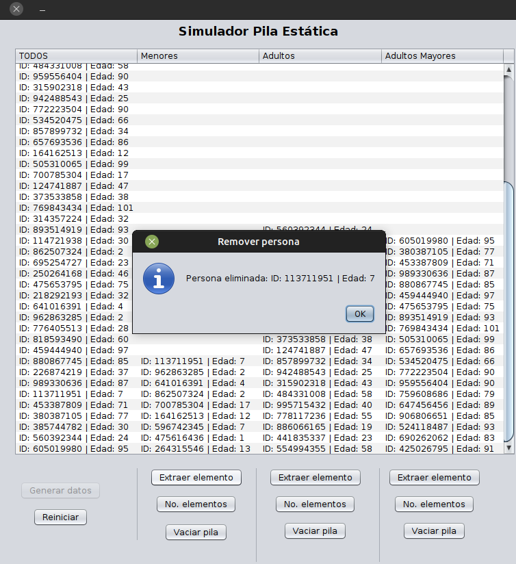
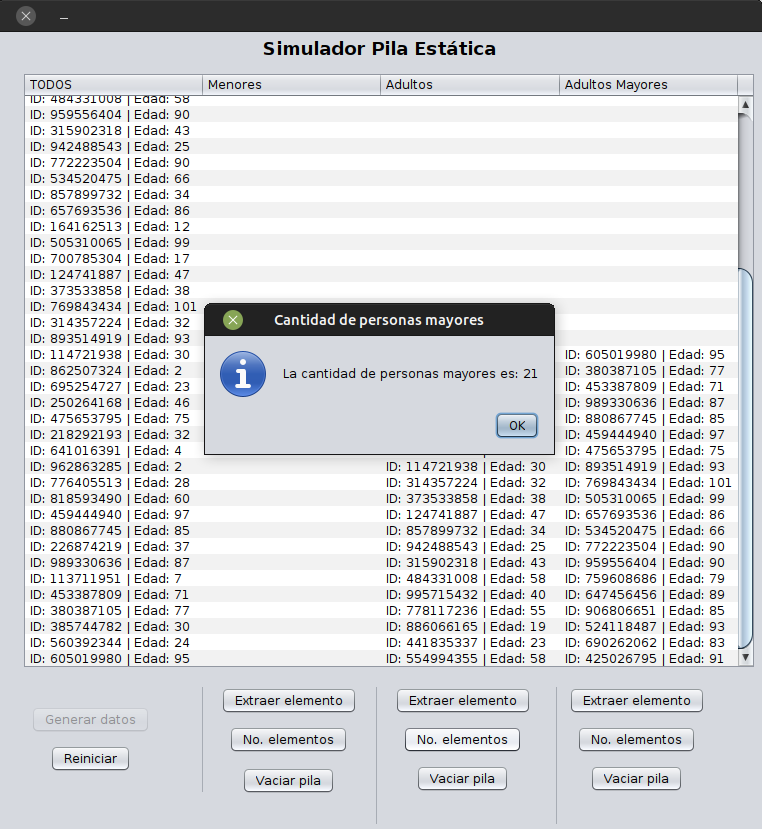

# Simulador Pila (stack) mediante arrays

## Características

* Genera un arreglo de objetos de 50 posiciones de manera aleatoria
* Cada posición almacena un objeto de tipo Persona (identificación y edad)
* El arreglo se divide en tres y los almacena en forma de pila: menores de edad, mayores de edad y adultos mayores
* Utiliza el método LIFO (last-in, first-out)
* El programa permite extraer el último elemento de cada pila (lo muestra antes de eliminarlo)
* Se puede vaciar cualquier pila cuando se desee
* El programa muestra cuántos elementos quedan en la pila

## Realizado en

* Lenguaje de programación Java
* Apache Netbeans 12.0
* OpenJDK 11
* Ubuntu MATE 20.04

## Capturas

**Menú**

**Pilas generadas y clasificadas**

**Extraer elemento**

**Contador de elementos**

